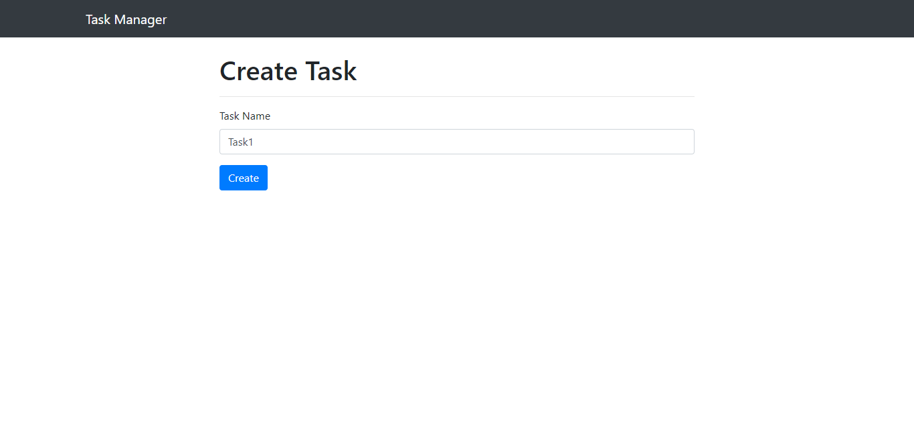

# Task Management

Basic CRUD operations for tasks. We can Create, Edit and Delete tasks. We car drag and drop tasks in order to set their priorities.

## Table of Contents

- [Installation](#installation)
- [Technology Used](#technologyUsed)
- [ScreenShots](#screenshots)

## Installation

1. Extract zip folder.
2. Install the dependencies:

   ```shell
   composer install
   
3. Configure the environment variables:
* Copy the .env.example file and rename it to .env.
* Open the .env file and set the necessary environment variables, such as database credentials.

4. Run the database migrations:
    ```shell
   php artisan migrate

5. Start the development server:
    ```shell
   php artisan serve

6. Access the application in your web browser at http://localhost:8000/tasks.

7. To install the sortablejs library using npm, you can run the following command in your project's root directory:
    ```shell
   npm install sortablejs

## Technology Used
1. Proper laravel concepts were used in making this projects.
2. Blade template used as frontend.

## ScreenShots
* Fetching data from sql and display it in table. Look carefully there are total 5 records.

* When create button is press then this type of view is seen, in which there is input to enter task name and a button to create.



